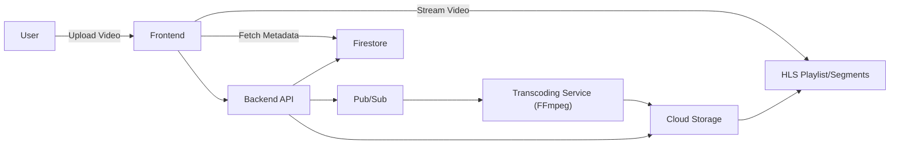

# StreamForge
**StreamForge** is a cloud-native video streaming platform inspired by YouTube, built to showcase scalable backend engineering and distributed systems design.

This project demonstrates:  
- Event-driven, distributed processing pipelines  
- Production-style cloud infrastructure design  
- Scalability, security, and cost optimization  

## Features
- Video upload with GCP Cloud Storage  
- Distributed video transcoding pipeline with FFmpeg + Pub/Sub  
- Adaptive video playback via HLS  
- Secure authentication & user management with Firebase Auth  
- Real-time data and metadata storage in Firestore  
- Containerized services deployed with Cloud Run (Docker + serverless)  

## Architecture

## Tech Stack
- **Backend:** Node.js, Express, FFmpeg  
- **Infrastructure:** Google Cloud (Cloud Storage, Pub/Sub, Cloud Run, Firestore)  
- **Auth:** Firebase Authentication  
- **Frontend:** React (Next.js)
- **Deployment:** Docker, CI/CD with GitHub Actions